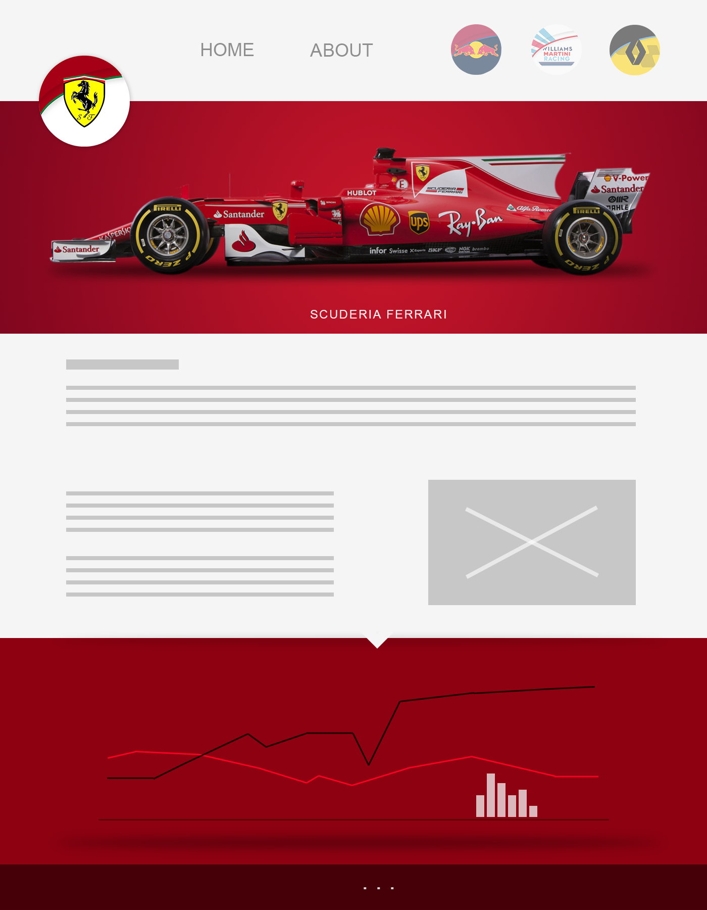
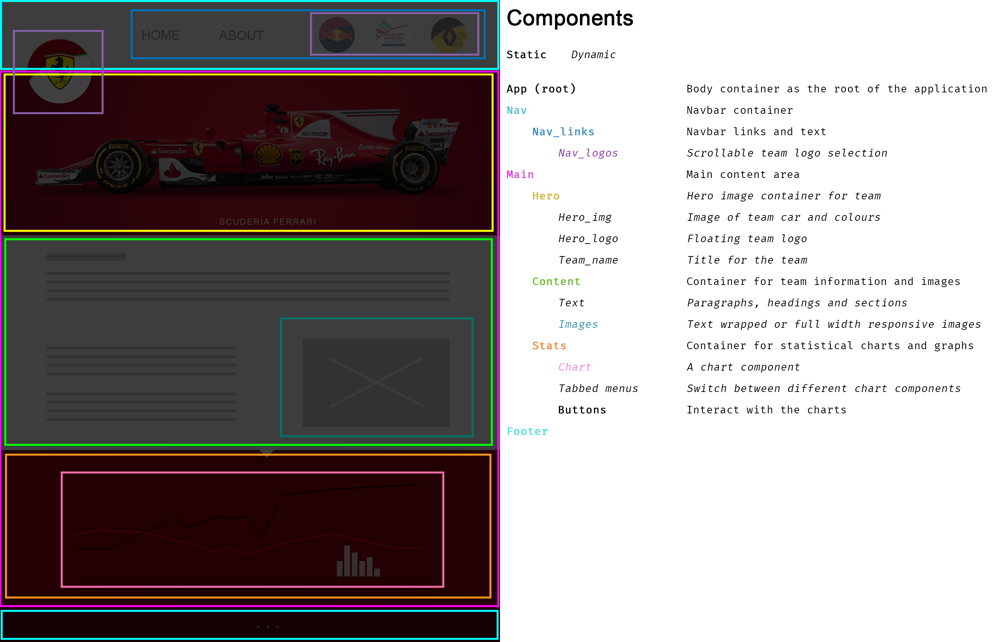
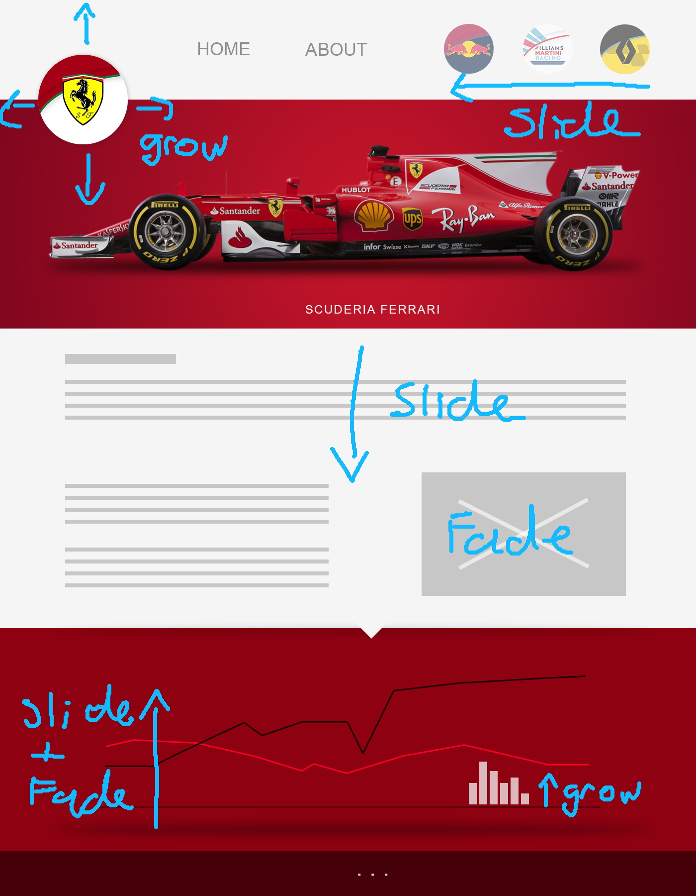

> Formula 1 Factoid Page

Requirements
============

-   Historical and factual information about Formula 1 teams (Static)

-   Updated statistics in charts and graphs (Dynamic)

-   Attractive mobile-friendly responsive design

-   Maximise use of space and layout

-   Animations on scroll for charts and graphics

-   Fast initial page load with asynchronous rendering

    **Data:**

-   Google shows table with F1 results

    -   Trend graph showing lap time deltas between teammates

        -   Expand with options to select each driver/team to compare

    -   Interactive section showing engine component usage with expanded
        information when selecting a component to view

    -   Graph showing penalty accumulation

    -   Display points for team in WCC, and points for each driver in WDC

        -   Comparison graph showing points between teammates

            -   Expand with option to compare points with any team/driver

    -   Analysis of practise and qualifying times (long runs, average pace)

    -   Team pit stop efficiency

    -   Specs for the car

Implementation
===============

1.  Obtain and organise static assets (high res images, fonts, colour theme
    etc.)

2.  Initial responsive page structure with flexbox.

    1.  Define content divisions, image placement and navigation.

3.  Implement static shell

4.  Initial style pass

    1.  Colour themes suited to each team

    2.  Minimalist design using responsive material design practices

    3.  Specify and organise reusable code (e.g. SASS mixins)

    4.  Parallax scrolling

5.  Draw charts and graphs on front-end (Static data)

    1.  Define JS functions to retrieve, process and display

    2.  Specify reusable components

        1.  Encapsulate each component allowing changes to be made from the UI

        2.  Follow Model-View-Controller

            1.  Model is the raw data

            2.  View is the web UI components

            3.  Controller interfaces with the view/model to get and update
                values, without the view and model interacting directly – i.e.
                controller is the coordinating object

    3.  Implement Chart.js to visualise data in responsive components

6.  Animate content

7.  Admin interface to edit data

    1.  Web UI with forms to update charts manually

    2.  Implement some form of CMS to handle changes with secure credentials

    3.  Send changes to required component

8.  Handle dynamic data and back-end (Node.js or Python)

    1.  Create database

    2.  Store and retrieve data, fetch from API sources and send updates to
        front-end

    3.  Automate retrieval and processing

Prototypes
==========

